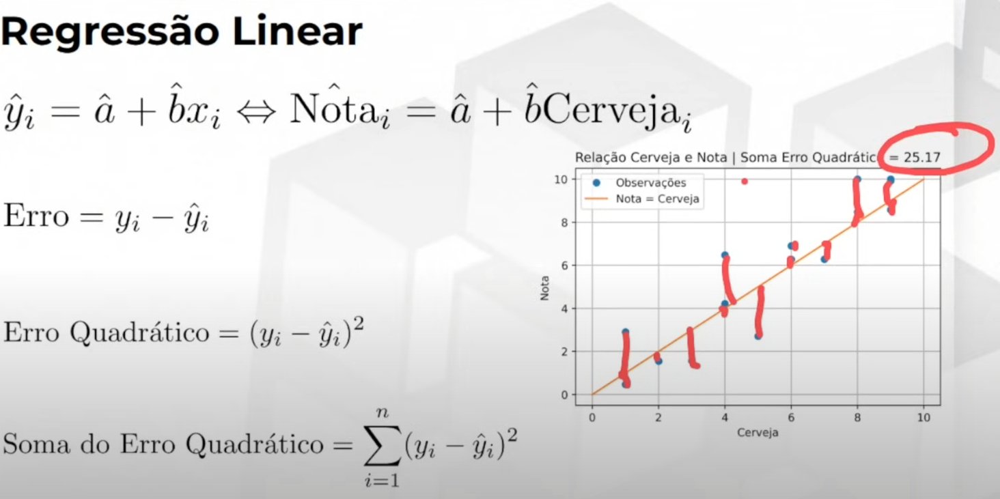
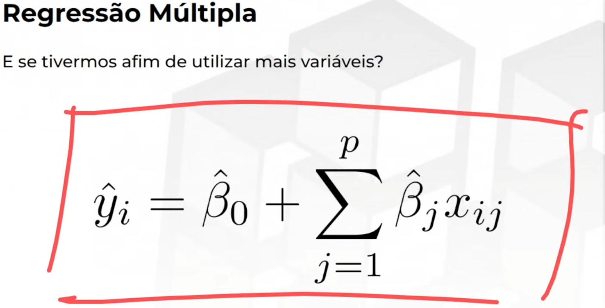
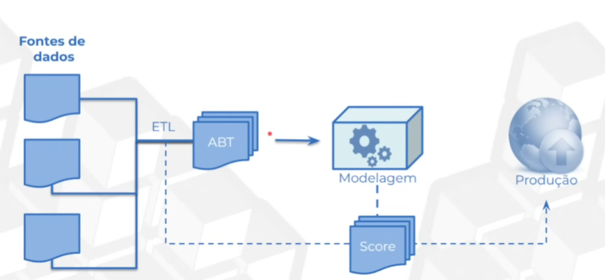

## Machine Learning
> Mastering knowledging about Data Science

### Supervisionado

Eu tenho um target específico para estimativa.

**Exemplos**: Quantidade de vendas, receita presuimda, valor de crédito, precificação de imóvel, volume de chuva

- **Classificação** : Variáveis qualitativas - Rotulos ou classe
- **Regressão** : Variáveis númericas - Estimativa de um número
- 

### Não supervisionado

Não tenho uma variável resposta

